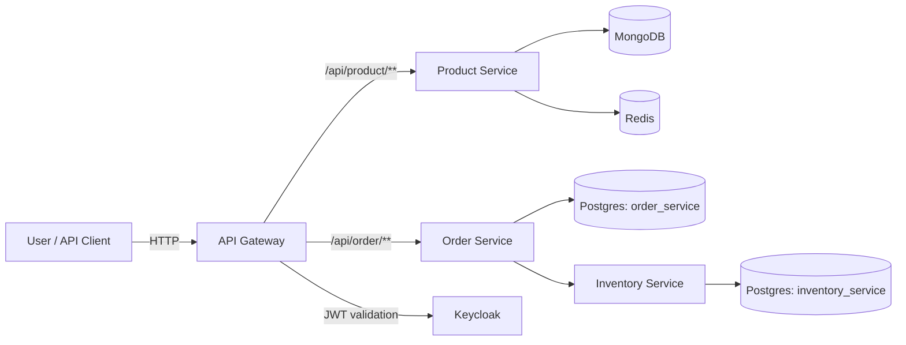

# Microservices Commerce Platform (Spring Boot)

A production-style **Java/Spring Boot microservices** system showcasing an **API Gateway**, **OIDC authentication with Keycloak**, and real-world persistence patterns (**PostgreSQL + MongoDB + Redis**)—all runnable locally via **Docker Compose**.

This repository is designed as a **portfolio-ready Backend/Full-Stack project**: clear docs, reproducible setup, and a realistic service layout.

## Architecture



## Tech Stack
- **Java 21**, **Spring Boot**, **Spring Cloud Gateway (MVC)**
- **Keycloak** (OIDC/JWT)
- **Kafka** (present in services where applicable)
- **PostgreSQL** (order + inventory), **MongoDB** (product), **Redis** (cache)
- **Docker Compose** (one-command local run)

## Quickstart (Local)

### 1) Run everything
```bash
docker compose up --build
```

### 2) Health checks
```bash
bash scripts/smoke-test.sh
```

### 3) Useful URLs
- API Gateway: http://localhost:9001
- Keycloak Admin: http://localhost:8080 (admin/password)
- Product Service Swagger: http://localhost:8084/swagger-ui
- Order Service Swagger: http://localhost:8082/swagger-ui
- Inventory Service Swagger: http://localhost:8083/swagger-ui

Optional tools (Mongo Express + RedisInsight):
```bash
docker compose --profile tools up -d
```

## Authentication (Keycloak)
The realm **spring-microservices-security-realm** is imported automatically at startup.

Local dev user:
- **username:** `demo`
- **password:** `demo`

If you want a token quickly via password grant (for local development/testing):
```bash
curl -s \
  -X POST "http://localhost:8080/realms/spring-microservices-security-realm/protocol/openid-connect/token" \
  -H "Content-Type: application/x-www-form-urlencoded" \
  -d "client_id=frontend-client" \
  -d "grant_type=password" \
  -d "username=demo" \
  -d "password=demo"
```

> Note: The demo user is for local development only.

## Repository Structure
```
api-gateway/         # single entry point; routes /api/product/** and /api/order/**
product-service/     # MongoDB + Redis
inventory-service/   # Postgres + Flyway migrations
order-service/       # Postgres + Flyway migrations; calls inventory-service
infra/               # init scripts + Keycloak realm import
scripts/             # dev-up / dev-down / smoke-test
docs/                # diagrams
```

## Build & Tests (local)
```bash
./gradlew clean build
```

## What this demonstrates (portfolio angle)
- Service decomposition and inter-service communication
- Secure gateway pattern with OIDC/JWT validation
- Polyglot persistence (SQL + NoSQL + caching)
- Reproducible local environment with Docker Compose
- Clean docs + runnable scripts (recruiter-friendly)
